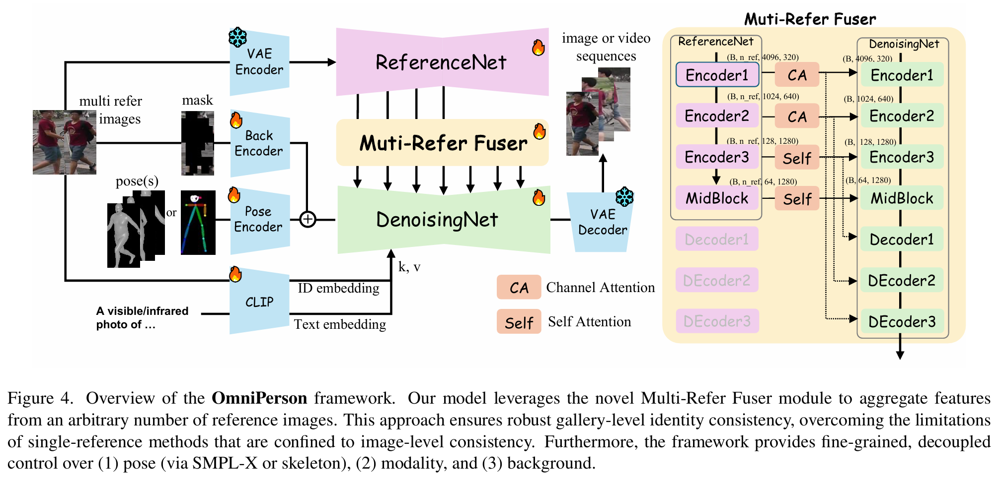

# OmniPerson: Unified Identity-Preserving Pedestrian Generation

<div align='center'>
    <a href='https://arxiv.org/abs/2512.02554'></a>
</div>

## 🔥 News 
* [2025.12.03] 🔥 Paper is available on [Arxiv](https://arxiv.org/abs/2512.02554)


## 📖 Introduction


OmniPerson is a unified framework for identity-preserving pedestrian generation. It aims to generate diverse and realistic pedestrian images while maintaining the identity of the person across different poses and viewpoints.

It supports various tasks such as:
- **Pose Transfer**: Transfer the pose of a person to another while preserving their identity. (supports Skeleton or Smplx poses inputs)
- **Modality Transfer**: Transfer the modality of a person to another, such as from RGB to Infrared.
- **Multi-references**: Support multiple reference images for a more precise generation. (no upper limit on the number of references)
- **Video Generation**: Generate a sequence of images that form a coherent video clip. (both IR and RGB)
- **Others**: Support various other tasks such as super-resolution, occlusion handling, and more.





## 📝 Release Plans

| Milestone | Status |
| --- | --- |
| Pretrained weights & Inference code | TBD |
| Training code | TBD |

## 📒 Citation

If you find our work useful for your research, please consider citing the paper:

```bash
@article{ma2025omniperson,
  title={OmniPerson: Unified Identity-Preserving Pedestrian Generation},
  author={Ma, Changxiao and Yuan, Chao and Shi, Xincheng and Ma, Yuzhuo and Zhang, Yongfei and Zhou, Longkun and Zhang, Yujia and Li, Shangze and Xu, Yifan},
  journal={arXiv preprint arXiv:2512.02554},
  year={2025}
}
```


